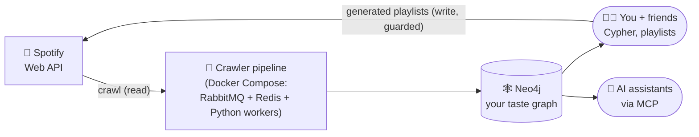

# Spotify Power Browser

For tastemakers and audiophiles of all kinds: a local data-engineering
pipeline that copies your Spotify listening data into a **graph database**,
then gives you (and your friends, and your AI assistant) ways to explore it
that Spotify never will.

One `docker compose up` brings up the whole thing — message queue, crawler
workers, even the Spotify login flow — and about twenty minutes later your
entire library is a graph you can query.



## What can it actually do?

- **Crawl** your Liked Songs — and optionally the full discographies of the
  artists you clearly love — into `Track`/`Album`/`Artist`/`Genre` nodes.
  Idempotent (re-crawls update, never duplicate), rate-limit-respecting, and
  restartable.
- **Master** your library: roll "Levitating", "Levitating – Radio Edit" and
  the deluxe re-release into one canonical *Song*, with a human review loop.
- **Multiplayer**: a friend logs in, their library lands in the same graph,
  and a query pack answers "what do we share, where do we diverge, what's
  new to both of us?"
- **Annotate** tracks while you listen — cue points, section maps, notes —
  straight into the graph from hotkeys.
- **Write back**: turn graph insights into real Spotify playlists, with
  dry-run defaults and a hard rule that it never touches playlists it didn't
  create.
- **Talk to it**: a read-only MCP server lets Claude explore the graph
  conversationally.

## Quickstart

You need three things installed and one thing registered:

1. **Docker Desktop**, running.
2. **Neo4j Desktop** with a database started (`bolt://127.0.0.1:7687`) — the
   graph lives here, on the host, [on purpose](docs/architecture.md#why-isnt-neo4j-a-container).
3. **A Spotify app** ([dashboard](https://developer.spotify.com/dashboard))
   with redirect URI `http://127.0.0.1:8000/callback` registered — the
   loopback IP exactly; Spotify rejects `localhost`.

Then populate `secrets/` (gitignored):

| File | Contents |
|------|----------|
| `secrets/spotify_client_id.secret` | your Spotify app's client ID |
| `secrets/spotify_client_secret.secret` | your Spotify app's client secret |
| `secrets/neo4j_credentials.yaml` | `username: neo4j` / `password: <your password>` |

And run it:

```bash
docker compose up
```

The stack starts, then **waits for you**: open http://127.0.0.1:8000/login,
log into Spotify, click Agree. Your token lands on disk, a healthcheck flips
green, and the crawl begins — raw JSON to `data/responses/`, the graph to
Neo4j. Watch it run at http://localhost:15672 (guest/guest) — the crawl is
done when the queues are empty and the rates hit zero
([how to read that screen](docs/observability.md)).

## Configuration

All flags live in [application/config.py](application/config.py) and are
overridable at the shell, e.g. `RESET_CRAWL=true docker compose up`:

| Setting | Default | Purpose |
|---------|---------|---------|
| `CRAWL_LIKED_SONGS` | `true` | crawl your saved tracks |
| `CRAWL_ARTIST_DISCOGRAPHIES` | `false` | also crawl full discographies of artists with ≥ `ARTIST_AFFINITY_MIN` (3) liked tracks |
| `USE_BATCH_ENDPOINTS` | `false` | Spotify's multi-id endpoints, ~22× fewer calls (live-verified for this app; re-verify with `scripts/probes/probe_batch_endpoints.py` if in doubt) |
| `CRAWLED_URL_DEDUP` | `true` | skip already-fetched URLs (Redis, persists across runs) |
| `RESET_CRAWL` | `false` | forget fetched URLs and crawl fresh (per-user in multiplayer mode) |
| `CRAWL_USER` / `CRAWL_ALL_USERS` | primary / `false` | whose library to crawl (multiplayer) |
| `DEPTH_OF_SEARCH` | `1` | how many hops to follow from a response |

## Where do I go next?

| I want to… | Read |
|---|---|
| understand how the pieces fit together | [docs/architecture.md](docs/architecture.md) |
| understand what's *in* the graph | [docs/data-model.md](docs/data-model.md) |
| actually explore my data (tutorial) | [docs/exploring-the-graph.md](docs/exploring-the-graph.md) |
| hook up Claude to the graph | [mcp_server/README.md](mcp_server/README.md) |
| add a friend's library | [docs/multiplayer-runbook.md](docs/multiplayer-runbook.md) |
| understand the login/token machinery | [docs/auth.md](docs/auth.md) |
| run tests / understand coverage | [docs/testing.md](docs/testing.md) |
| know how builds & runs work (incl. offline mock runs) | [docs/delivery.md](docs/delivery.md) |
| watch a crawl and interpret what I see | [docs/observability.md](docs/observability.md) |
| compare the Lucid vs Mermaid diagrams | [docs/diagrams/README.md](docs/diagrams/README.md) |
| see what's done and what's next | [ROADMAP.md](ROADMAP.md) · [docs/plans/](docs/plans/README.md) |

Every folder also has its own README (start at
[application/README.md](application/README.md)).

## The post-crawl toolkit

```bash
# enrich artists with popularity/followers (discovery ranking needs this)
docker compose run --rm responses_write_to_neo4j python3 -m application.discovery.backfill_artists

# dedupe releases into canonical Songs, then read data/mastering_review.md
docker compose run --rm responses_write_to_neo4j python3 -m application.mastering.run

# annotate while listening (hotkeys: n note, c cue, s section, q quit)
docker compose run --rm responses_write_to_neo4j python3 -m application.annotations.listen

# turn discoveries into a real playlist (dry-run by default; --apply to do it)
docker compose run --rm responses_write_to_neo4j python3 -m application.playlists.sync adjacent-discoveries
```

## Tests

```bash
docker compose run --rm tests
```

Unit, integration, end-to-end, and failure-injection tests against a bundled
mock Spotify; your real secrets are mounted read-only so the suite can't
touch them. Details: [docs/testing.md](docs/testing.md).

## Stack

Python 3.13 · Poetry 2.4 · Falcon 4 · pika/RabbitMQ 4 · Redis 8 ·
Neo4j (driver 6) · pytest 8 · MCP SDK. Everything ships in one Docker image.
