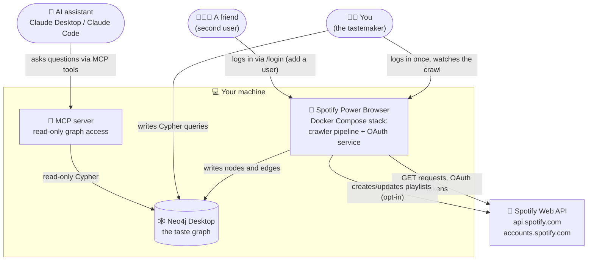
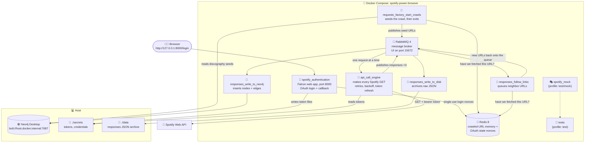
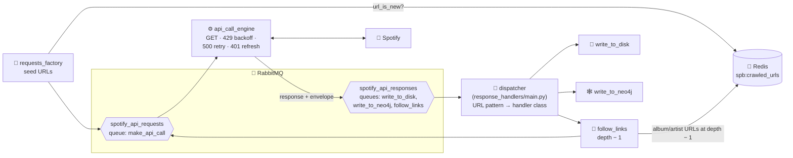

# Architecture: the big picture

Spotify Power Browser copies your Spotify listening data into a graph database
(Neo4j) so you can explore it — on your own, with a friend, or with an AI
assistant. This document explains how the pieces fit together, starting from
the widest view and zooming in. It follows the
[C4 model](https://c4model.com/): **Level 1** shows the system in its world,
**Level 2** shows the running containers, **Level 3** shows the moving parts
inside the pipeline.

Every diagram here also exists in Lucid — see
[docs/diagrams/README.md](diagrams/README.md) for the side-by-side index.

---

## Level 1: The system in its world



Three things live on your machine:

1. **The Docker Compose stack** — a crawler pipeline plus a small web service
   for Spotify login. It reads from Spotify and writes into Neo4j. It can also
   write *back* to Spotify, but only to playlists it created itself.
2. **Neo4j Desktop** — the database that holds the graph. It runs on the host
   (not in Docker) so you keep its browser UI and your data survives anything
   Docker does.
3. **The MCP server** — a small read-only doorway that lets an AI assistant
   query the graph in natural language. It runs on demand, not as part of the
   stack.

Everything is local. There is no cloud deployment and no CI today (that is a
deliberate choice, not an accident — see [delivery.md](delivery.md)).

---

## Level 2: The containers

One `docker compose up` starts everything below. All the Python services share
**one Docker image** (`spotify-power-browser`), built once from the repo's
[Dockerfile](../Dockerfile) — each service just runs a different command
inside it.



### What each service does

| Service | One-line job | Waits for |
|---|---|---|
| `rabbitmq` | The mailbox between every stage. Management UI at http://localhost:15672 (guest/guest). | — |
| `redis` | Remembers every URL already crawled (survives restarts) and holds one-time login nonces. | — |
| `spotify_authentication` | Serves the login page; turns your Spotify consent into token files under `secrets/`. | redis |
| `api_call_engine` | The only service that talks HTTP to Spotify. Consumes request URLs, GETs them, fans results out. | rabbitmq, redis, **auth healthy** |
| `responses_write_to_disk` | Saves every raw JSON response to `data/responses/` as an audit trail. | rabbitmq |
| `responses_write_to_neo4j` | Translates responses into graph inserts (`MERGE`, so re-crawls are safe). | rabbitmq |
| `responses_follow_links` | Finds album/artist references inside responses and queues them for fetching — this is what makes it a *crawler*. | rabbitmq, redis |
| `requests_factory_start_crawls` | Publishes the first URLs (your Liked Songs page, discography seeds) and exits. | everything above |
| `spotify_mock` | A fake Spotify for tests and offline runs. Off unless you ask for the `test`/`mock` profile. | — |
| `tests` | The pytest runner (`docker compose run --rm tests`). Off unless you run it. | rabbitmq, redis, mock |

### Why isn't Neo4j a container?

Neo4j Desktop already runs on the host with its own browser UI and persistent
storage, and a containerized Neo4j would fight it for port 7687. The workers
reach it through Docker's `host.docker.internal` gateway. A commented-out
`neo4j` service in [compose.yaml](../compose.yaml) shows how to go
fully-in-Docker if you prefer.

### The one clever trick at startup

`spotify_authentication` has a healthcheck that only passes **once a token
file exists**. The pipeline services declare they depend on it being healthy.
The effect: `docker compose up` starts the infrastructure, then *pauses* until
you visit http://127.0.0.1:8000/login and click Agree on Spotify's consent
page. The moment your token lands on disk, the health flips green and the
crawl starts on its own. One command, one human click, no scripts in between.
The full auth story is in [auth.md](auth.md).

---

## Level 3: Inside the pipeline

Everything between "a URL we want" and "data in the graph" flows through two
RabbitMQ exchanges. A message is a small JSON envelope:

```json
{
  "request_url": "https://api.spotify.com/v1/me/tracks?offset=0&limit=20",
  "depth_of_search": 1,
  "user_id": "michaelwheeler"
}
```



Step by step:

1. **Seeding.** `requests_factory` publishes the first page of your Liked
   Songs (and, if `CRAWL_ARTIST_DISCOGRAPHIES=true`, one discography URL per
   artist you clearly love). Every URL passes through one choke point,
   `request_url()`, which asks Redis "have we fetched this before?" and skips
   it if so.
2. **Fetching.** `api_call_engine` consumes one URL at a time and GETs it with
   your bearer token. It absorbs the three ways Spotify says no: **429** (rate
   limited — sleep for `Retry-After`, capped at 10 minutes), **500** (retry up
   to 5 times), **401** (token expired — refresh it and retry). If it gives up
   on a URL it *un-marks* it in Redis so a future run can try again. Paginated
   responses (`"next"` links) are re-queued at the same depth.
3. **Fan-out.** Each successful response is published three times, once per
   routing key, so three independent workers process it in parallel.
4. **Dispatch.** Each worker maps the response's URL to a handler class — e.g.
   `/v1/me/tracks` → `LikedSongsPlaylistResponseHandler`, `/v1/albums?ids=` →
   `GetSeveralAlbumsResponseHandler`. One handler class knows everything about
   one Spotify endpoint: where to save it on disk, which Cypher inserts it,
   which links inside it are worth following.
5. **The loop.** `follow_links` publishes the albums and artists mentioned in
   a response back onto the request queue at **depth − 1**. Depth 0 means
   "save this but follow nothing." That number is the crawler's only brake —
   and with Redis dedup it is what keeps a 12,000-track library from becoming
   a million requests.

### Frequently asked questions

**Why a message queue at all?** Three reasons. It decouples slow Spotify
fetching (one careful, rate-limited worker) from fast local writing (parallel
workers). It survives crashes — queues are durable, so a restart picks up
where it left off. And it gives you free monitoring: the RabbitMQ UI shows
exactly how much work is left (see [observability.md](observability.md)).

**Why both Redis and RabbitMQ?** They do different jobs. RabbitMQ is the
mailbox: work that *should happen next*. Redis is the memory: work that
*already happened* (the crawled-URL set persists across runs on a named
volume, so tomorrow's crawl skips everything today's crawl fetched).

**What happens if a worker dies mid-crawl?** Queues are durable and messages
are persistent, so nothing queued is lost. The engine and workers reconnect
in a loop rather than exiting. The one loss window — a URL marked "crawled"
whose fetch then failed forever — is closed by the dedup rollback in step 2.

**How does a crawl end?** It just drains. When the queues are empty and
message rates hit zero, the crawl is done. There is no completion
notification — see [observability.md](observability.md) for how to watch it.

**What's `write_to_sqlite`?** A stub from the project's early days; the flag
is off and every handler raises `NotImplementedError`. It's listed as a
removal candidate in [ROADMAP.md](../ROADMAP.md).

---

## Where the code lives

| Path | What's inside | README |
|---|---|---|
| `application/` | Everything the pipeline runs | [README](../application/README.md) |
| `application/spotify_authentication/` | OAuth web service, token storage, refresh | [README](../application/spotify_authentication/README.md) |
| `application/response_handlers/` | One handler class per Spotify endpoint + dispatcher | [README](../application/response_handlers/README.md) |
| `application/graph_database/` | Neo4j connection, every Cypher query, migrations | [README](../application/graph_database/README.md) |
| `application/message_queue/` | RabbitMQ connect/declare/publish helpers | [README](../application/message_queue/README.md) |
| `application/cache/` | Redis client: URL dedup + OAuth nonces | [README](../application/cache/README.md) |
| `application/discovery/` | Artist popularity backfill for discovery ranking | [README](../application/discovery/README.md) |
| `application/mastering/` | "Same song, five releases" dedup into canonical Songs | [README](../application/mastering/README.md) |
| `application/annotations/` | Timestamped notes/cues/sections on tracks | [README](../application/annotations/README.md) |
| `application/playlists/` | Graph-driven playlists written back to Spotify | [README](../application/playlists/README.md) |
| `mcp_server/` | Read-only MCP server for AI graph exploration | [README](../mcp_server/README.md) |
| `mock_spotify/` | Controllable fake Spotify (tests + offline runs) | [README](../mock_spotify/README.md) |
| `tests/` | The pytest suite | [README](../tests/README.md) |
| `docs/plans/` | Feature plans (implemented and pending) | [README](plans/README.md) |
