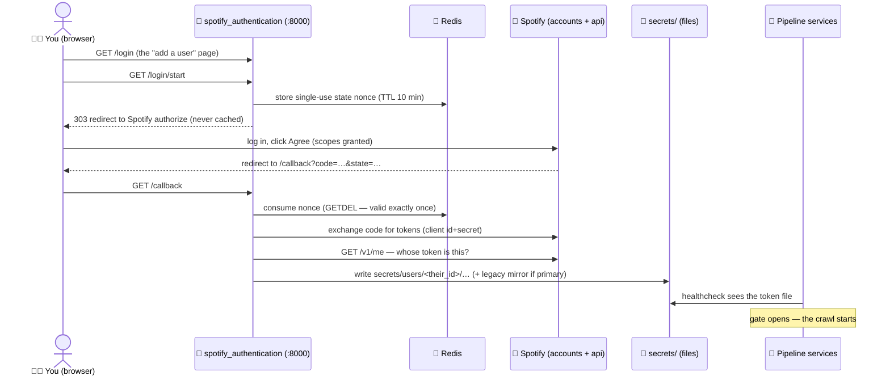

# Identity and access: how Spotify auth works here

Everything in this project that talks to Spotify does it with an OAuth 2.0
bearer token. This document explains where those tokens come from, where they
live, how they stay fresh, and exactly where the auth code touches the rest of
the system — because it is deliberately self-contained and could be lifted out
as its own small library.

The code lives in
[application/spotify_authentication/](../application/spotify_authentication/)
— three files, three jobs:

| File | Job |
|---|---|
| `api_authorization_web_service.py` | The login web app (Falcon, port 8000): `/login`, `/login/start`, `/callback` |
| `token_store.py` | Reads/writes token files, handles multi-user namespacing and the "primary user" rules |
| `refresh_token.py` | Trades a refresh token for a fresh access token when the old one expires |

---

## The login flow, step by step



Details worth knowing:

- **The state nonce is CSRF protection.** `/login/start` mints a random
  value, parks it in Redis with a 10-minute TTL, and sends it to Spotify.
  `/callback` will only proceed if it can atomically consume that exact value
  (`GETDEL` — so it works exactly once). The redirect is a `303` with
  `Cache-Control: no-store` because a cacheable redirect would replay a
  used-up nonce and mysteriously break every later login from that browser.
- **Identity is derived, not assumed.** The callback never trusts who it
  *thinks* logged in; it asks `GET /v1/me` whose token it just received, and
  files the tokens under that user id.
- **Scopes are bundled.** One consent grants everything any current feature
  needs, so nobody has to re-authorize per feature:

  | Scope | Used by |
  |---|---|
  | `user-library-read` | The Liked Songs crawl |
  | `user-read-playback-state` | Live annotation capture (`listen.py`) |
  | `playlist-modify-private` | Playlist write-back |
  | `playlist-read-private`, `user-follow-read`, `user-read-recently-played`, `user-top-read` | Plan 02 (listening history) — requested now so it's ready |

---

## Where tokens live

```
secrets/
├── spotify_client_id.secret          ← your app's ID (you create this)
├── spotify_client_secret.secret      ← your app's secret (you create this)
├── spotify_api_token.secret          ← LEGACY MIRROR: the primary user's access token
├── spotify_refresh_token.secret      ← LEGACY MIRROR: the primary user's refresh token
└── users/
    ├── .primary_user                 ← contains the primary user's id
    ├── michael/
    │   ├── spotify_api_token.secret
    │   └── spotify_refresh_token.secret
    └── sarah/
        └── …
```

**The primary user** is simply the first account that ever logged in, and the
role is sticky — later logins never steal it. Their tokens are *mirrored* to
the two legacy top-level files on every save and refresh. Two things depend on
that mirror:

1. The compose healthcheck (`test -s secrets/spotify_api_token.secret`) that
   gates the whole pipeline — so one `docker compose up` still works with any
   number of users.
2. Older single-user code paths that read the legacy files directly.

Practical rule: **don't delete the legacy files or `.primary_user`** while the
system is in use. (The full "remove a user / change primary" procedure is in
the [multiplayer runbook](multiplayer-runbook.md).)

User ids come back from a remote API but are used as directory names, so
`token_store.validate_user_id()` rejects anything that could traverse paths.

---

## Staying logged in: token refresh

Spotify access tokens die after about an hour; crawls can run longer. When the
engine gets a **401** it calls `refresh_spotify_auth(user_id)`, which POSTs
the refresh token to Spotify **with HTTP Basic client authentication** —
that last part matters, because omitting it was the bug that used to kill
every crawl at the one-hour mark (fixed in PR #16).

Two subtleties the code handles for you:

- Spotify usually *omits* a new refresh token in the response; the old one
  stays valid and is kept (RFC 6749 §6 behavior).
- Refreshes are mirrored **both ways** for the primary user: a legacy-path
  refresh updates the namespaced files and vice versa. If they drifted, the
  primary's next 401 would replay a stale refresh token and Spotify would
  reject it (`invalid_grant`), wedging their crawl until a manual re-login.

If a refresh fails outright (revoked grant, deleted token file), the engine
rolls back the "already crawled" mark on the URL it was fetching, so nothing
is silently lost — the URL is retried after you re-authorize.

---

## Where auth touches the rest of the codebase

The surface is intentionally tiny. Only three production modules import from
`spotify_authentication`:

| Caller | What it uses | Why |
|---|---|---|
| `application/api_call_engine.py` | `read_api_token`, `refresh_spotify_auth`, `has_user` | Attach a bearer to every GET; refresh on 401 |
| `application/playlists/sync.py` | `refresh_spotify_auth` | Same refresh-and-retry when writing playlists |
| `application/response_handlers/me/my_liked_songs.py` | `validate_user_id` | Safe per-user directory names for the disk archive |

(Plus the migration runner, which reads the primary user id as a default, and
the tests.)

**Could this be extracted as a standalone library?** Yes, with one caveat.
The web service + token store + refresh logic have no dependency on the
pipeline — they know nothing about RabbitMQ, Neo4j, or crawling. The one
external dependency is Redis, used only for the login nonces; an extracted
version would either bring a Redis client along or accept any
store-and-consume-once backend. The interface the rest of an application needs
is four functions: `read_api_token(user_id)`, `save_tokens(…)`,
`refresh_spotify_auth(user_id)`, `list_user_ids()`.

---

## FAQ

**Why must the redirect URI be `http://127.0.0.1:8000/callback` and not
`localhost`?** Spotify rejects `localhost` as insecure but accepts the
loopback IP. It must match the Spotify app dashboard exactly.

**Why does the pipeline wait for me at startup?** The auth container's
healthcheck only passes once a token file exists and is non-empty. Every
pipeline service depends on that health. The healthcheck's `start_period` is
one hour, so compose patiently shows "waiting" rather than failing while you
find your password.

**How does a second person log in?** Same page — `/login`, then "Add a
user". Their tokens land in their own directory and the primary is untouched.
One prerequisite: while your Spotify app is in development mode you must
allowlist their email in the Spotify developer dashboard first. Full walkthrough:
[multiplayer runbook](multiplayer-runbook.md).

**What would production hardening look like?** Tokens are plaintext files on
disk, which is fine for a personal project on your own machine and the reason
this section exists in the AWS plans: the migration sketch moves them to AWS
Secrets Manager (see [delivery.md](delivery.md)).
