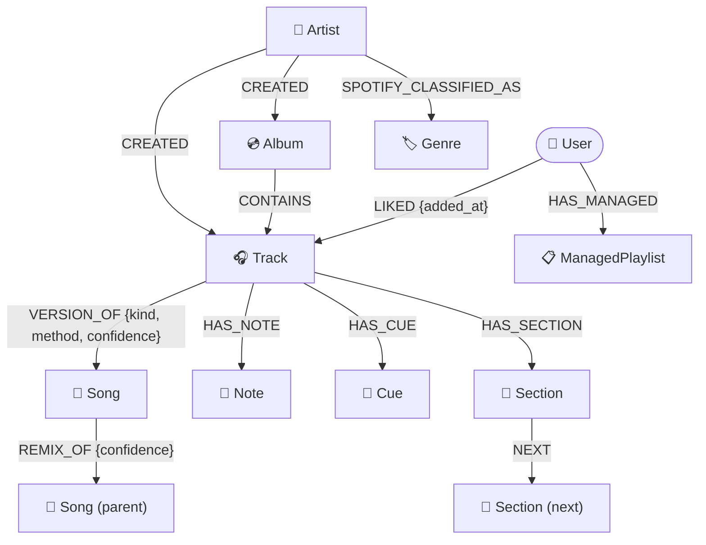
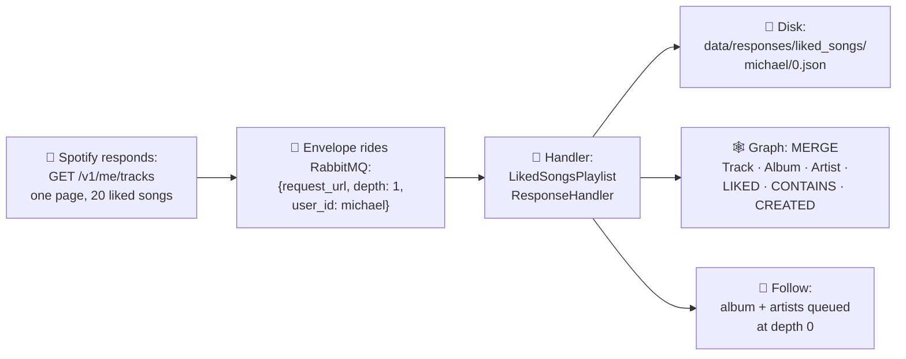
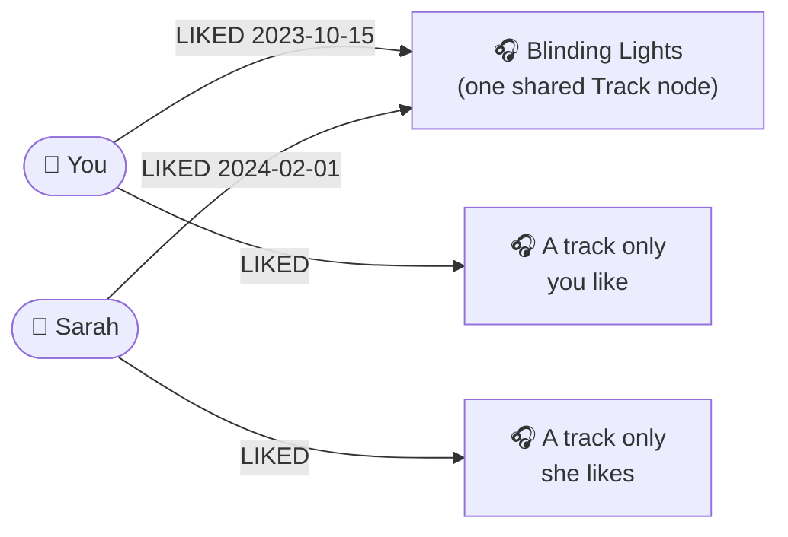

# The data model, told as a story

This document explains what's actually *in* the graph — not as a schema dump,
but by following real data through the system. If you read only one doc before
opening the Neo4j browser, read this one.

The Mermaid diagrams here have Lucid twins — see
[docs/diagrams/README.md](diagrams/README.md).

---

## The cast of characters

Every node in the graph is one of these:

| Node | What it represents | Where it comes from |
|---|---|---|
| `Track` | One playable recording on Spotify | The crawl |
| `Album` | One release (album, single, compilation) | The crawl |
| `Artist` | One artist page on Spotify | The crawl |
| `Genre` | A Spotify genre tag like "uk garage" | Artist metadata during the crawl |
| `User` | A person whose library is in this graph | Migration 0001 + each `/login` |
| `Song` | One *canonical* song, no matter how many releases it's on | The mastering batch job |
| `Note`, `Cue`, `Section` | Your timestamped listening annotations | The annotation CLIs |
| `ManagedPlaylist` | A Spotify playlist this system created and maintains | The playlist sync CLI |

And the relationships between them:



Two layers matter enormously and are worth naming:

- **The catalog layer** (`Track`, `Album`, `Artist`, `Genre`, `Song`) is
  *shared*. These nodes are `MERGE`d on stable Spotify IDs, so if you and a
  friend both like "Blinding Lights", there is exactly **one** Track node and
  you both point at it.
- **The ownership layer** (`User` and its `LIKED` / `HAS_MANAGED` edges) is
  *per-person*. Who likes what lives on relationships, never on the catalog
  nodes themselves. This is what makes shared graphs work.

---

## Story 1: One liked song's journey into the graph

You tapped ♥ on **"Blinding Lights"** in October 2023. Here is what happens
when the crawler meets that fact.



**1. Spotify answers.** One page of your Liked Songs arrives as JSON. The
interesting part of one item:

```json
{
  "added_at": "2023-10-15T14:22:00Z",
  "track": {
    "id": "0VjIjW4GlUZAMYd2vXMwbk",
    "name": "Blinding Lights",
    "duration_ms": 200040,
    "external_ids": { "isrc": "USUG11904206" },
    "album":   { "id": "4yP0hdKOZPNshxUOjY0cZj", "name": "After Hours" },
    "artists": [ { "id": "1Xyo4u8uIGDwSrnxfEnP4x", "name": "The Weeknd" } ]
  }
}
```

**2. The graph write.** The handler runs
[insert_batch_of_liked_songs.cypher](../application/graph_database/queries/insert_batch_of_liked_songs.cypher),
which `MERGE`s (create-if-missing, reuse-if-present):

```
(:User {id: "michael"})
      -[:LIKED {added_at: "2023-10-15T14:22:00Z"}]-> (:Track {id: "0VjIjW…", name: "Blinding Lights", isrc: "USUG…"})
(:Album {id: "4yP0…", name: "After Hours"}) -[:CONTAINS]-> that Track
(:Artist {id: "1Xyo…", name: "The Weeknd"}) -[:CREATED]->  that Track
(:Artist)                                    -[:CREATED]->  that Album
```

Notice *when you liked it* lives on the `LIKED` edge — a fact about you — while
*how long the song is* lives on the Track — a fact about the world.

**3. The ripple.** `follow_links` queues the album and artist URLs at
depth − 1. Their full objects arrive later and enrich the same nodes (genres
land on the Artist, release date on the Album). Because everything is MERGE,
re-crawling next month updates in place; nothing duplicates.

Multiply this by ~12,500 liked songs and you get the real numbers from the
first full crawl: **12,547 Tracks, 9,832 Albums, 7,587 Artists, 634 Genres in
about 18 minutes.**

---

## Story 2: Five releases, one song (mastering)

Your library almost certainly contains the same recording several times:
"Levitating", "Levitating – Radio Edit", "Levitating (Deluxe)". For counting
and DJ purposes those are one song. The **mastering** job
(`python -m application.mastering.run`) rolls them up without destroying
anything:

```
(:Track "Levitating")               -[:VERSION_OF {kind: "canonical",  method: "isrc",      confidence: 1.0}]-> (:Song "levitating")
(:Track "Levitating – Radio Edit")  -[:VERSION_OF {kind: "radio_edit", method: "heuristic", confidence: 0.85}]-> same Song
(:Song "levitating (the blessed madonna remix)") -[:REMIX_OF {confidence: 0.9}]-> (:Song "levitating")
```

How it decides two Tracks are the same Song, strongest evidence first:
**1)** same ISRC (the recording industry's serial number), **2)** Spotify's
own `linked_from` re-linking, **3)** a heuristic — same normalized title +
same primary artist + duration within 3 seconds, **4)** your manual overrides
in `secrets/mastering_overrides.yaml`, which always win. Remixes are *never*
merged into their parent — a remix is a different song — they get their own
Song plus a `REMIX_OF` edge.

Every run writes a human review report to `data/mastering_review.md`, most
ambiguous clusters first, so you can catch bad merges and fix them with an
override. Details: [application/mastering/README.md](../application/mastering/README.md).

---

## Story 3: A friend joins the graph (multiplayer)

Sarah logs in through `/login` and you crawl her library
(`CRAWL_USER=sarah docker compose up requests_factory_start_crawls`). What
changes in the graph?

- A `(:User {id: "sarah"})` node appears.
- Her ~3,000 liked songs become `(:User {id:"sarah"})-[:LIKED]->(:Track)`
  edges. Where you overlap, her edges attach to **your existing Track nodes** —
  no duplication, the overlap simply *is* the set of Tracks with two LIKED
  edges.
- The shared catalog gets a little bigger (her tracks you'd never heard of).



This is why migration
[0001_multiplayer_ownership](../application/graph_database/migrations/0001_multiplayer_ownership.cypher)
exists: the original single-user graph marked likes as a `liked_songs: true`
property *on the Track itself*, which can't distinguish two people. The
migration lifted every such flag onto a `LIKED` edge owned by you. (Migration
0002, still a guarded stub, will eventually delete the legacy properties once
the rollback window closes.)

Once two users are in, the **overlap query pack**
([queries/overlap/](../application/graph_database/queries/overlap/)) answers
the fun questions — see [exploring-the-graph.md](exploring-the-graph.md) for a
guided tour.

---

## Story 4: A listening session leaves a trail (annotations)

You put on an album and run the live-capture CLI
(`python3 -m application.annotations.listen`). Every time you tap a hotkey it
polls where playback is and writes a node:

- tap `c` at the drop → `(:Track)-[:HAS_CUE]->(:Cue {at_ms: 130000, label: "drop"})`
- tap `n` and type a thought → `(:Track)-[:HAS_NOTE]->(:Note {text: "…", at_ms: 41000})`
- tap `s` at each boundary → `(:Section {kind: "buildup", start_ms, end_ms})`
  nodes, chained to each other with `NEXT` edges in time order

The `NEXT` chain is kept sorted by start time even if you mark boundaries out
of order, and the insert queries only ever `MATCH` the Track — you can't
annotate a song the crawl hasn't seen. Details:
[application/annotations/README.md](../application/annotations/README.md).

---

## Story 5: The graph writes back (managed playlists)

Insights shouldn't be trapped in the database. The playlist sync CLI turns a
graph query into a real Spotify playlist and records what it did:

```
(:User)-[:HAS_MANAGED]->(:ManagedPlaylist {
    spotify_id: "3cEYpjA9oz9GiPac4AsH4n",
    generator: "adjacent_discoveries",
    params_hash: "a94a8fe5…",        // same inputs → same playlist next run
    last_synced: "2026-07-06T21:04:00Z",
    target_snapshots: [ …last 3 track lists, for rollback… ]
})
```

The safety rule is absolute: before any write to Spotify, the sync code checks
the playlist ID is recorded as managed here. Hand-made playlists are never
touched. Dry-run is the default. Details:
[application/playlists/README.md](../application/playlists/README.md).

---

## Reference: properties you'll actually query

- **Track** — `id`, `name`, `duration_ms`, `explicit`, `isrc` (for
  mastering), `artist_ids` (credit order; element 0 is the primary artist).
- **Album** — `id`, `name`, `release_date`, `album_type`, `total_tracks`.
- **Artist** — `id`, `name`, `popularity` (0–100, filled by the
  [backfill](../application/discovery/README.md); `null` means "not enriched
  yet"), `followers`.
- **Genre** — just `name`. Genres hang off Artists, not Tracks, because that's
  how Spotify models them.
- **User** — `id` (the Spotify username), `display_name`, `added_at`.
- **LIKED edge** — `added_at`: when that user liked that track. The backbone
  of every taste-over-time question.
- **VERSION_OF edge** — `kind` (canonical / remaster / radio_edit / live /
  clean / explicit / demo / remix), `method` (isrc / linked_from / heuristic /
  manual), `confidence` (0–1).

Uniqueness constraints exist on `Track.id`, `Album.id`, `Artist.id`,
`Song.id`, `User.id`, `Note.id`, `Cue.id`, `Section.id`, and
`ManagedPlaylist.spotify_id` — applied automatically at startup by
[initialize_database_environment.py](../application/graph_database/initialize_database_environment.py).

---

## FAQ

**Why is `liked` a relationship and not a property?** Because "liked" is a
fact about a *(person, track)* pair. As a property, one graph can hold one
person's taste. As a relationship, it holds any number of people — and overlap
questions become simple pattern matches.

**What happens on a re-crawl?** Everything is `MERGE` on stable IDs:
existing nodes are updated (`ON MATCH SET` refreshes things like popularity),
new nodes are created, and nothing duplicates.

**Do Tracks belong to a User?** No. Catalog nodes are ownerless and shared.
Deleting a user (`DETACH DELETE` their User node + removing their token
directory) removes their edges and leaves the catalog intact — that's the
"right to be forgotten" one-liner in the
[multiplayer runbook](multiplayer-runbook.md).

**Where do Play / listening-history nodes fit?** They don't exist yet. Plan 02
(listening completeness) will add `(:User)-[:DID]->(:Play)-[:OF]->(:Track)`
when Spotify's extended streaming history export is ingested.
