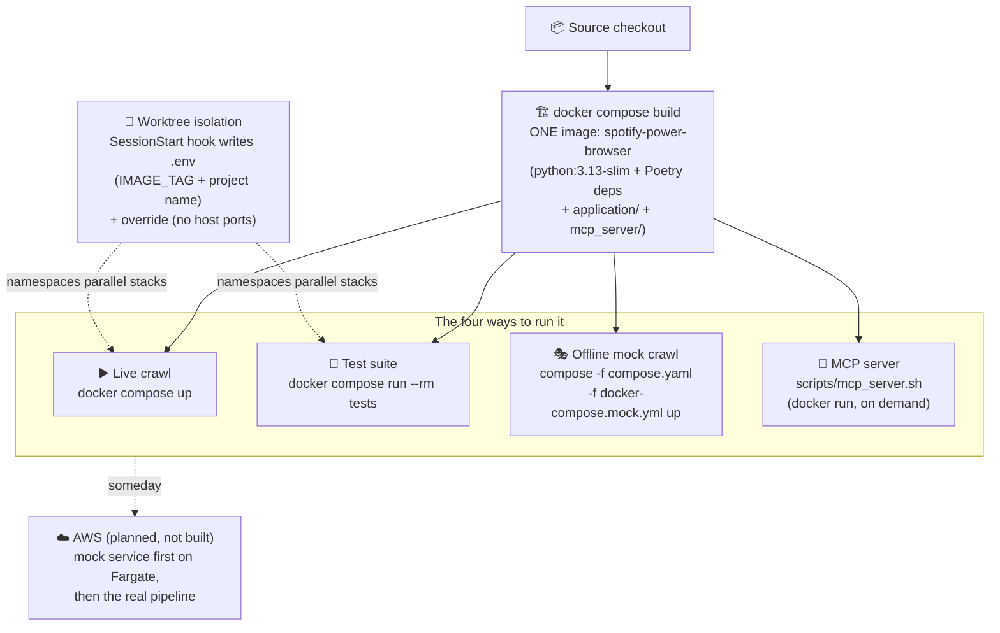

# Delivery: how this software gets built and run

Short version: **everything is local Docker Compose.** There is no CI, no
GitHub Actions, no cloud deployment — the repo on GitHub is source hosting
only. This page covers the paths that do exist, and the AWS path that's
planned but not built.



---

## One image for everything

The [Dockerfile](../Dockerfile) builds a single image: Python 3.13-slim,
Poetry-installed dependencies, plus the `application/` and `mcp_server/`
source. Every compose service uses that same image and just runs a different
`command:`. So "deploying a change" is:

```bash
docker compose build          # rebuild the shared image
docker compose up             # services pick it up
```

There's no registry; the image only ever lives in your local Docker daemon.
Dependencies are pinned by `poetry.lock`, so builds are reproducible.

## Path 1: the live crawl

```bash
docker compose up
```

Starts RabbitMQ, Redis, the auth service, and the pipeline workers; pauses at
the OAuth gate until you log in at http://127.0.0.1:8000/login; then crawls.
The startup choreography is described in
[architecture.md](architecture.md#the-one-clever-trick-at-startup), the knobs
(RESET_CRAWL, CRAWL_USER, …) in the [root README](../README.md#configuration).
The `spin-up` skill (`.claude/skills/spin-up/`) walks an AI assistant through
the whole thing.

## Path 2: the test suite

```bash
docker compose run --rm tests
```

The `tests` and `spotify_mock` services are **profile-gated** — they exist in
compose.yaml but are not part of a normal `up`. This command brings up
RabbitMQ, Redis, and the mock, then runs pytest. Tests that need the host
Neo4j skip politely if it isn't running. The secrets directory is mounted
**read-only** so no test can ever clobber your real tokens. More in
[testing.md](testing.md).

## Path 3: the offline mock crawl

```bash
echo -n mock-access-token > secrets/spotify_api_token.secret
echo -n mock-refresh-token > secrets/spotify_refresh_token.secret
RESET_CRAWL=true docker compose -f compose.yaml -f docker-compose.mock.yml up
```

[docker-compose.mock.yml](../docker-compose.mock.yml) is an overlay that
points every pipeline service's Spotify URLs at the bundled fake
(`http://spotify_mock`). The whole crawl then runs with **no internet and no
real account** against a deterministic synthetic catalog — useful for demos,
debugging the pipeline itself, and testing failure handling (the mock can be
told to throw 429s/401s/500s on command). See
[mock_spotify/README.md](../mock_spotify/README.md).

## Path 4: the MCP server

```bash
bash scripts/mcp_server.sh     # (Claude launches this for you via .mcp.json)
```

Not a compose service at all: a `docker run --rm -i` of the same image,
started on demand by an AI client and speaking MCP over stdio. See
[mcp_server/README.md](../mcp_server/README.md).

---

## Parallel checkouts: the worktree trick

If you (or several Claude Code sessions) work in git worktrees, all those
checkouts share one Docker daemon — and would normally fight over the image
tag `latest`, the compose project name, and host ports 5672/15672/8000.

A `SessionStart` hook ([scripts/worktree_compose_env.sh](../scripts/worktree_compose_env.sh))
solves this. In any checkout under `.claude/worktrees/` it writes two
gitignored files:

- **`.env`** — `IMAGE_TAG=<branch-slug>` and
  `COMPOSE_PROJECT_NAME=spotify-power-browser-<branch-slug>`, so each worktree
  builds its own image tag and gets its own containers/networks/volumes.
- **`compose.override.yaml`** — `ports: !reset []`, so worktree stacks publish
  **no host ports** (their services talk over the project network).

The primary checkout is deliberately left alone: it keeps `latest`, the
published ports, and the warm `redis_data` volume. **Live crawls run only from
the primary checkout, one at a time** — they share the real Neo4j graph and
the real dedup cache, which don't multiplex.

## What about CI?

There is none — no `.github/` directory exists. Tests run when you run them.
This is the honest current state, and adding a GitHub Actions workflow
(build the image, run the unit-and-mock subset of the suite) is the obvious
first step whenever the project wants it; nothing in the test design blocks
it, since the suite already skips service-dependent tests gracefully.

## What about the cloud?

Planned, not built. The strategy (written up in
[mock-spotify-service.md](mock-spotify-service.md)) is deliberately
mock-first:

1. ✅ **Done:** configurable Spotify base URLs; the mock service with failure
   injection (this is what the resilience tests use today).
2. **Next:** deploy the *mock* to AWS Fargate as a throwaway first workload —
   learn the ECS/ALB/IaC ropes on something with no secrets and no state.
3. **Then:** migrate the real pipeline: workers → Fargate, RabbitMQ →
   Amazon MQ or SQS, Redis → ElastiCache, Neo4j → Aura, token files →
   Secrets Manager.

Until then, treating "my laptop" as the production environment is a feature:
one command, no bill, and your listening data never leaves your machine.
