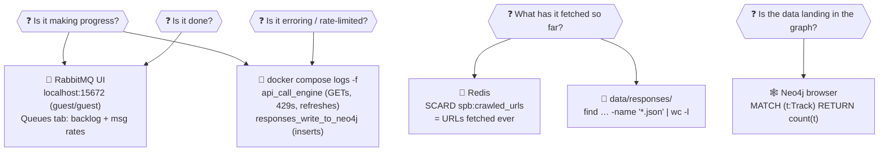

# Observability: watching a crawl run

There is no dashboard. There *are* five good windows into a running system,
and knowing which one answers which question is most of the skill. This page
is the field guide; the honest list of gaps is at the bottom.



---

## Window 1: the RabbitMQ management UI (your main gauge)

Open **http://localhost:15672**, log in `guest`/`guest`, go to the **Queues**
tab. You'll see the four queues; how to read them:

| Queue | Meaning of a growing backlog |
|---|---|
| `make_api_call` | Normal mid-crawl. This is the frontier — every URL still to fetch. It grows while `follow_links` discovers faster than the engine fetches (it always does), then drains. |
| `write_to_disk` / `write_to_neo4j` | Should stay near zero — these workers are faster than the engine feeds them. A persistent backlog here means that worker is stuck (check its logs). |
| `follow_links` | Same: near zero is healthy. |

**Reading the rates:** the *Message rates* columns are the pulse. Publish ≈
deliver ≈ ack, all above zero → healthy crawl. **All rates at zero and all
queues empty → the crawl is finished.** That's the completion signal; nothing
announces it.

**Common pattern:** `make_api_call` has messages but its deliver rate is ~0
for minutes → the engine is sleeping through a `429` backoff. Confirm in the
engine log.

## Window 2: the logs

Logs go to container stdout (plain text, no files on disk), so `docker
compose logs` is the whole story:

```bash
docker compose logs -f api_call_engine            # every GET as it happens
docker compose logs -f responses_write_to_neo4j   # inserts landing in the graph
docker compose logs --since 10s api_call_engine | grep -c 'GET:'   # throughput; 0 = idle
```

What to look for in the engine log:

- `GET: https://…` — the steady heartbeat. Silence means idle or backoff.
- `429` + a sleep message — rate-limited. Normal in bursts; the sleep is
  capped at 10 minutes no matter what Spotify asks for.
- `401` + `refreshing` — the hourly token refresh. Should succeed quietly;
  a refresh *failure* means your grant was revoked → re-login.
- Repeated reconnect messages — the broker connection dropped; the loop
  reconnects on its own. Occasional is fine, constant is a problem.

## Window 3: Redis (what's been fetched)

```bash
docker compose exec redis redis-cli SCARD spb:crawled_urls        # catalog URLs ever fetched
docker compose exec redis redis-cli KEYS 'spb:crawled_urls:*'     # per-user sets (multiplayer)
```

The set persists across runs (that's the point — it's why a second `up`
doesn't re-crawl). Watching `SCARD` climb is the crudest possible progress
bar, but it works.

## Window 4: the disk archive

```bash
find data/responses -name '*.json' | wc -l
du -sh data/responses
```

One JSON file per fetched resource, organized by endpoint
(`liked_songs/<user>/`, `tracks/`, `albums/`, …). Doubles as the audit trail
when you wonder "what exactly did Spotify return for this album?"

## Window 5: the Neo4j browser (the point of it all)

```cypher
MATCH (t:Track) RETURN count(t);                       // watch it climb mid-crawl
MATCH (u:User)-[:LIKED]->(t) RETURN u.id, count(t);    // per-user library sizes
MATCH (a:Artist) WHERE a.popularity IS NULL
RETURN count(a);                                       // artists awaiting enrichment
```

Inserts are visible immediately — there's no batching delay between the
pipeline and the database.

---

## A healthy crawl, as a timeline

1. **Minute 0:** `up`; RabbitMQ and Redis go healthy; everything else waits on
   the auth gate. *You log in.*
2. **Minutes 1–3:** `make_api_call` backlog balloons (liked-songs pages fan
   out into thousands of album/artist follows). This looks alarming and is
   normal.
3. **Steady state:** backlog drains at the engine's pace. Expect occasional
   429 pauses.
4. **Done:** rates flatline at zero, queues empty. For reference, the first
   full crawl (≈12.5k tracks, batching on) took **~18 minutes** end to end.

## The gaps (things you might expect and won't find)

- **No metrics or dashboards.** No Prometheus, no Grafana. The RabbitMQ UI is
  the only live gauge, and it doesn't keep history.
- **No alerting.** A wedged crawl doesn't page you; you notice by looking.
- **No completion signal.** "Queues empty + rates zero" is the definition of
  done.
- **Plain-text logs, lost on `down`.** A structured (JSON) formatter exists in
  `application/loggers.py` but is switched off; logs live only in the
  container's buffer.
- **No tracing.** You can't follow one URL's journey across services except by
  grepping logs for it.

For a personal, watch-it-run project these are reasonable trade-offs; the
first two would matter the moment this runs unattended in the cloud
([delivery.md](delivery.md)).
