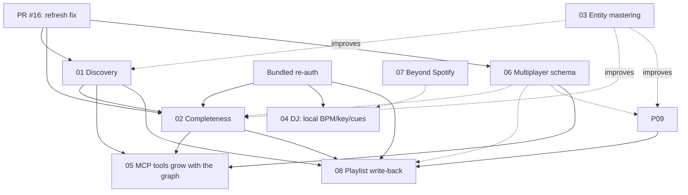

# Feature implementation plans

_Written 2026-07-06, the day the first full-library crawl completed (12,547 tracks,
9,832 albums, 7,587 artists, 634 genres — zero 429s). Each plan is self-contained
and delegation-ready: hand one to a coding agent with this README for context._

## The plans

| # | Plan | One-liner | Status |
|---|------|-----------|--------|
| 01 | [Adjacent-artist discovery](01-adjacent-artist-discovery.md) | Find unknown artists two collab-hops from your taste | **Shipped** (PR #22) |
| 02 | [Listening completeness](02-listening-completeness.md) | Full listening history + "how much of this artist have I really heard?" | Pending — blocked on the streaming-history export |
| 03 | [Entity mastering](03-entity-mastering.md) | Roll deluxe/single/clean-explicit re-releases into canonical Songs | **Shipped** (PR #20) |
| 04 | [Annotations & DJ sets](04-annotations-and-dj-sets.md) | Timestamped song notes → DJ set planning → performance HUD | **Phases A+B shipped** (PR #21); C+D pending |
| 05 | [Graph MCP server](05-graph-mcp-server.md) | Let AI query your taste graph with purpose-built tools | **Shipped** (PR #19) |
| 06 | [Multiplayer](06-multiplayer.md) | Two users, one graph — intersect and diff musical taste | **Shipped** (PR #24) |
| 07 | [Beyond Spotify](07-beyond-spotify.md) | Local files + SoundCloud in one platform-agnostic graph | Pending (XL, phased) |
| 08 | [Playlist write-back](08-playlist-writeback.md) | Every insight becomes a real Spotify playlist | **Shipped** (PR #23) |
| 09 | [Taste over time](09-taste-over-time.md) | Your musical eras, drift, and year-in-review from timestamps you already have | Pending |

Effort legend: **S** ≤1 day · **M** 2–4 days · **L** 1–2 weeks · **XL** multi-week, phased.

## Verified API surface (probed live 2026-07-06)

Spotify's 2024-11-27 policy removed several endpoints for new apps; the 2026-02
changelog targeted (then postponed) the batch endpoints. This app (created
2023-04) was probed with a live token via `scripts/probes/probe_api_surface.py`:

| Endpoint | Result | Meaning for the plans |
|----------|--------|----------------------|
| `/v1/me`, single + batch `?ids=` tracks/albums/artists | **200** | Core crawl machinery intact (batch verified again) |
| `/v1/artists/{id}/albums` | **200** | Discography crawling works → plans 01, 02 |
| `/v1/search` | **200** | Cross-platform matching works → plan 07 |
| `/v1/artists/{id}/related-artists` | **404 — removed** | Collab-graph adjacency is the discovery mechanism → plan 01 |
| `/v1/recommendations` | **404 — removed** | Same |
| `/v1/audio-features`, `/v1/audio-analysis` | **403 (no message) — removed** | No Spotify BPM/key/sections; DJ data comes from local analysis / Rekordbox / manual → plans 04, 07 |
| `/v1/me/player/recently-played`, `/v1/me/top/*` | **403 "Insufficient client scope" — alive** | Unlocked by a re-auth with new scopes → plan 02 |

A 403 **without** a message body = removed-for-this-app; a 403 **with**
"Insufficient client scope" = endpoint alive, token lacks the scope. Re-probe
any of this with `scripts/probes/probe_api_surface.py` before building on it.

## Do these first (shared foundations)

1. **Request the extended streaming history export TODAY** (plan 02 §1). It
   takes days–weeks to arrive and nothing else blocks on it — pure lead time.
2. **One bundled scope expansion + re-auth** (single human login) covering every
   plan that needs new scopes, instead of one re-auth per feature:
   `user-read-recently-played user-top-read user-read-playback-state
   playlist-modify-private playlist-modify-public` (plans 02, 04, 08 — the
   current scope string lives in `application/spotify_authentication/api_authorization_web_service.py`).
3. **ISRC + popularity enrichment backfill** (plans 03 §T1–T3, 01 §T2): ~500
   batch calls total, minutes of runtime, and nearly every plan's data quality
   improves. Do it before the next big crawl.
4. ~~Merge PR #16 first~~ — merged; token refresh carries client auth now.

## Dependency map

Solid arrow = hard prerequisite; dotted = quality/feature improvement.

## Suggested build order

1. **05 MCP server** — small, independent, and multiplies the value of the graph
   you have *today* (AI-driven exploration starts immediately).
2. **03 mastering** (at least the ISRC backfill) — data quality for everything.
3. **01 discovery** — the flagship insight feature; implements the Stage-2 stub
   handlers as a side effect.
4. **02 completeness** — export requested on day 1 arrives around when the code
   is ready; scopes bundled with 04/08's.
5. **06 multiplayer** — schema migration lands before Play/playlist rels multiply.
6. **08 playlists → 09 taste-over-time** — fast, high-delight paybacks.
7. **04 DJ sets** — the deepest one; phase it, starting with the annotation model.
8. **07 beyond Spotify** — local files first (they also feed 04's BPM/key needs),
   SoundCloud after its API access question is answered.

## Conventions the plans share

- **Additive schema only**: new labels/rels/properties; never rename or repurpose
  existing ones (`Track`, `Album`, `Artist`, `Genre` and their rels stay stable).
  Migrations are explicit one-off Cypher scripts under `application/graph_database/migrations/`.
- **Feature flags** follow the `_env_bool` pattern in `application/config.py`,
  wired through `compose.yaml` `environment:` passthroughs (the hard-won lesson
  of PR #15).
- **Mock-first testing**: every new Spotify endpoint a plan consumes gets a mock
  facade route + catalog support in `mock_spotify/` in the same PR, per the
  fidelity lesson of PR #16 (a permissive mock hid a live 400 for weeks).
- **Branch-per-feature, atomic commits, tests via `docker compose run --rm tests`.**
