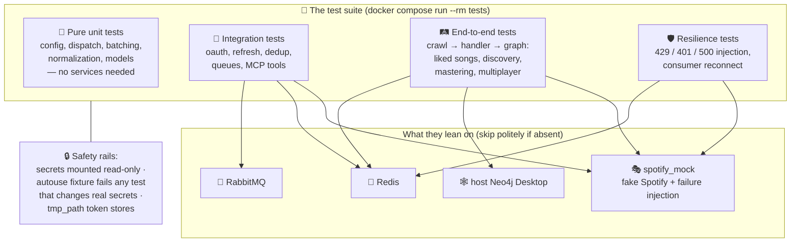

# Testing: what's covered and how to read the suite

The suite is ~37 files under [tests/](../tests/). This page explains how it's
organized, how to run it, why it can't hurt your real data, and where the gaps
are. The per-file inventory lives in [tests/README.md](../tests/README.md).



## How to run it

```bash
docker compose run --rm tests                                   # everything
docker compose run --rm tests python3 -m pytest tests/test_engine_resilience.py -v   # one file
docker compose run --rm tests python3 -m pytest tests/ -k "mastering" -v             # one topic
```

The command brings up RabbitMQ, Redis, and the mock automatically (compose
dependencies). Tests that need the host Neo4j Desktop **skip** if it isn't
running — skips are normal, failures are not. It's safe to run during a live
crawl *from a worktree checkout* (isolated stack); from the primary checkout
the suite would share the crawl's RabbitMQ and Redis.

## The four layers, and how to read them

**1. Pure unit tests** (`test_config`, `test_dispatcher`, `test_batch_handler`,
`test_mastering_normalize`, `test_annotations_model`, …). No services; they
pin down decisions in pure functions. Read these first when you want to know
"what is the rule?" — e.g. `test_mastering_normalize.py` is effectively the
spec for which title suffixes get stripped.

**2. Integration tests** (`test_oauth_service`, `test_refresh_token`,
`test_redis_dedup`, `test_rabbitmq`, `test_mcp_server_*`, …). One real service
plus real code. Read these to learn a component's contract — e.g.
`test_redis_dedup.py` shows exactly how per-user vs shared dedup sets behave.

**3. End-to-end tests** (`test_e2e_crawl`, `test_discovery_e2e`,
`test_multiplayer_e2e`, `test_mastering_e2e`). A crawl response flows through
real handlers into a real graph. `test_multiplayer_e2e.py` is the best
narrative read in the suite: two users crawl, overlap queries run, migrations
apply — the whole multiplayer story in one file.

**4. Resilience tests** (`test_engine_resilience`,
`test_engine_consumer_resilience`, `test_engine_multiuser`). These encode the
hard-won lessons of live crawls. The mock is told to fail on command
(`POST /_control/config {"fail_next_n": 1, "fail_status": 429}`), and the
tests assert the engine backs off with a cap, refreshes on 401, rolls back the
dedup mark when it gives up, and reconnects when the broker connection drops.
Each of these corresponds to a real incident that once killed a crawl.

## Why the suite can't hurt your real data

Three independent rails, because one failed once:

1. **Read-only mount.** Compose mounts `./secrets:ro` into the test
   container — a stray write is a loud `OSError`, not a silent overwrite.
2. **A tripwire fixture.** `conftest.py` snapshots the real `secrets/` before
   every test and fails the test if anything changed. This exists because a
   refresh-token test once silently replaced live tokens (fixed in PR #27).
3. **tmp_path token stores.** Auth tests monkeypatch every token path into a
   throwaway directory.

Graph-touching tests use prefixed fixture data (e.g. `MCPTEST…`) and purge
exactly that data — they share your real Neo4j instance but not your real
nodes.

## Known gaps

- **No CI** — the suite only runs when someone runs it ([delivery.md](delivery.md)).
- **No equivalence test** between `USE_BATCH_ENDPOINTS=true` and `false`
  crawl results.
- **Single-failure injection only** — no test throws 429+500+401 chaos
  simultaneously.
- **Query performance** is untested; overlap/discovery queries are verified
  for correctness on small seed graphs only.
- The two unimplemented handlers (`my_followed_playlists`,
  `my_followed_artists`) have no tests because they have no code (plan 02).
