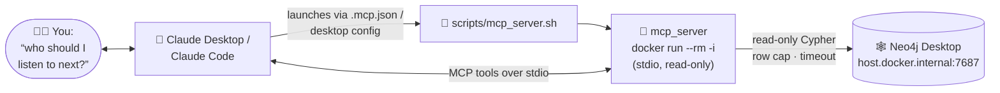

# spotify-graph MCP server

A **read-only** MCP server that lets an AI assistant query your Neo4j taste
graph — you ask questions in English, it writes the Cypher. It runs over
**stdio inside the project Docker image** and talks to Neo4j Desktop on the
host, exactly like the `responses_write_to_neo4j` compose service.



## Setup

1. Build the image once: `docker compose build`.
2. Have Neo4j Desktop running, with `secrets/neo4j_credentials.yaml` in place
   (the server starts fine without it; the first tool call needs it).

**Claude Code** — nothing to do. The project-root [.mcp.json](../.mcp.json)
registers the server; a fresh session in this repo picks it up.

**Claude Desktop** — add to
`~/Library/Application Support/Claude/claude_desktop_config.json` (macOS),
with the absolute path to your checkout:

```json
{
  "mcpServers": {
    "spotify-graph": {
      "command": "bash",
      "args": ["/Users/michael/software_projects/spotify-power-browser/scripts/mcp_server.sh"]
    }
  }
}
```

**ChatGPT Desktop — currently a gap.** ChatGPT's connector system only talks
to *remote* MCP servers over HTTP(S); it cannot launch a local stdio process
the way Claude clients can. Making this work would mean wrapping the server
in an HTTP gateway (e.g. an MCP stdio→HTTP proxy) and exposing it through a
tunnel — technically possible, but that publishes a doorway to your personal
listening data, so it isn't provided here. If ChatGPT support matters, the
clean path is adding a `streamable-http` transport option to `server.py` and
running it only on localhost networks that ChatGPT can reach.

## What to ask it

Good first prompts once connected: *"What does my taste graph look like?"*
(triggers `graph_schema`), *"Find artists similar to but more obscure than
Four Tet"* (`discover_adjacent`), *"Who has collaborated with both Caribou
and Floating Points?"* (`collaborators_of`), or anything ad hoc — the model
falls back to writing Cypher through `run_cypher_readonly`. A guided tour of
worthwhile questions: [docs/exploring-the-graph.md](../docs/exploring-the-graph.md).

## Tools (v1)

| Tool | Signature | Notes |
|------|-----------|-------|
| `graph_schema` | `()` | Live labels / rel types / patterns / counts — call first |
| `run_cypher_readonly` | `(query, params?)` | Escape hatch; write clauses rejected, rows capped, timeout |
| `find_artist` / `find_track` | `(name, limit=25)` | Fuzzy lookup; resolve exact names for the tools below |
| `collaborators_of` | `(artist_names[], limit=25)` | Shared track credits, ranked by seeds bridged |
| `discover_adjacent` | `(seed_artist_names?, max_popularity=40, min_bridges=2, limit=50)` | The adjacent-artist discovery query |
| `artist_completeness` | `(artist_name, limit=10)` | **Degraded mode**: liked-vs-catalog until plan 02's listening history lands |

Resources: `schema://graph` (live schema JSON) and `queries://cookbook`
(every curated Cypher file from `application/graph_database/queries/`,
including the two-user overlap pack — ask the assistant to read the cookbook
and run one).

### Current limitations

- **Popularity depends on enrichment.** `Artist.popularity` is filled by
  `python -m application.discovery.backfill_artists`; un-enriched artists
  have NULL, are treated as *unknown* (included regardless of
  `max_popularity`, flagged `popularity_unknown: true`), and every affected
  payload says so.
- **No purpose-built multi-user tool yet.** The multiplayer schema shipped
  (plan 06), and the overlap queries are reachable via the cookbook +
  `run_cypher_readonly`; a first-class `shared_taste(user_a, user_b)` tool is
  the natural next addition.
- `map_playlist_to_graph` (plan 05 §T6) still needs a live probe of
  algorithmic-playlist access before it's worth building.
- Results are capped (200 rows default) and queries time out (30 s default) —
  by design; refine rather than raise.

## Read-only enforcement (belt + suspenders)

1. Every session opens with `default_access_mode=READ_ACCESS`, so **Neo4j
   itself** rejects writes — including write *procedures* a keyword scan
   can't see. This is the real enforcement point.
2. A word-boundary guard rejects queries containing
   `CREATE/MERGE/DELETE/DETACH/SET/REMOVE/DROP/FOREACH/LOAD CSV` with a
   friendly error, after stripping string literals, backtick identifiers and
   comments (so `CONTAINS 'set me free'` doesn't false-positive).
3. Row cap (`MCP_ROW_CAP`, default 200 — results carry a `truncated` flag)
   and query timeout (`MCP_QUERY_TIMEOUT_SECONDS`, default 30) bound
   pathological generated queries.

## Environment

| Variable | Default | Meaning |
|----------|---------|---------|
| `NEO4J_HOSTNAME` | `host.docker.internal` (set by the wrapper) | Where Neo4j lives |
| `MCP_ROW_CAP` | `200` | Max rows any query returns |
| `MCP_QUERY_TIMEOUT_SECONDS` | `30` | Server-side query timeout |

The wrapper script forwards all three from the host environment.

## Development loop

Code changes need an image rebuild (`docker compose build`) to reach the
server — or bind-mount your working copy over the baked-in package while
iterating:

```bash
[ -f .env ] && set -a && . ./.env && set +a   # pick up a worktree's IMAGE_TAG
docker run --rm -i \
    --add-host host.docker.internal:host-gateway \
    -e NEO4J_HOSTNAME=host.docker.internal \
    -v "$(pwd)/secrets":/src/secrets \
    -v "$(pwd)/mcp_server":/src/mcp_server \
    spotify-power-browser:${IMAGE_TAG:-latest} python3 -m mcp_server
```

Never print to **stdout** from server code — stdio transport uses it for
JSON-RPC frames. `mcp_server/loggers.py` streams to stderr for exactly this
reason (unlike `application/loggers.py`).

Tests: `tests/test_mcp_server_readonly.py` runs anywhere (pure Python);
`tests/test_mcp_server_tools.py` needs Neo4j and skips when it's unreachable;
`tests/test_mcp_server_wiring.py` needs the `mcp` SDK (i.e. a rebuilt image)
and skips without it. All run under `docker compose run --rm tests`.
